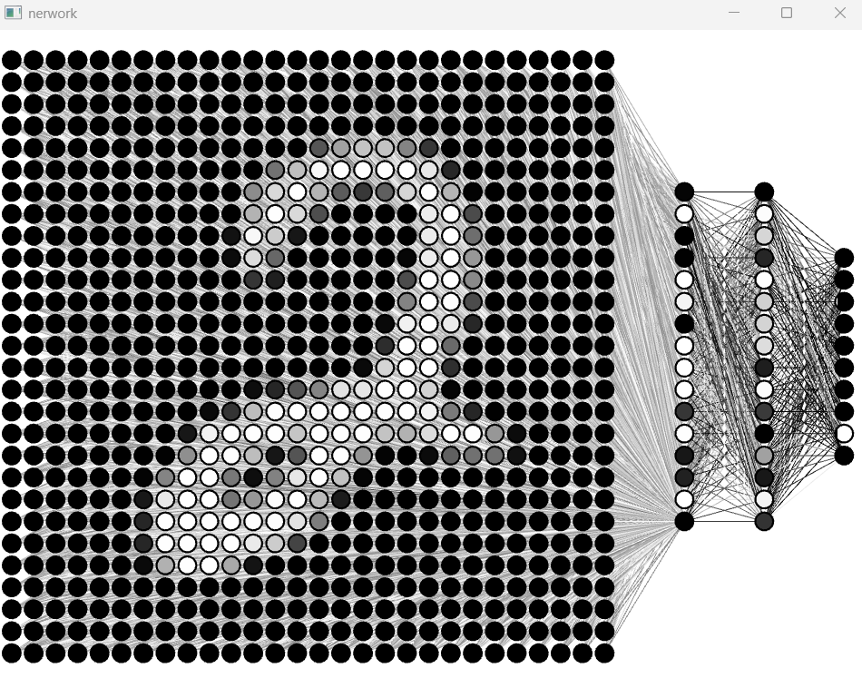

# Nerwork

This application is built for windows 64 bit

> gcc nerwork.c -L./Windows -lglfw3 -lopengl32 -lgdi32 -O3 -lglad -o nerwork.exe

> nerwork.exe

optional flags
-w: supply weights and biases file (exampleWeightsAndBiases.txt)
-t: supply training data (mnist_test.csv)

(example)
> nerwork.exe -w exampleWeightsAndBiases.txt -t mnist_test.csv

keybinds:
mouse: draw your own samples (click and drag on layer 1 node square (28 * 28))
space: load random sample (from supply training data)
c: clear layer 1 nodes (for drawing your own)
t: begin training
s: save weights and biases to file
a: save drawn data to dataset file
l: load sample manually (labelled by number)
r: randomise weights and biases (reset before training)
f: calculate cost (for current loaded instance)
g: calculate average cost
w: toggle wire render
q: change wire thresh (visual only, unless doWireCulling is 1)
arrow keys: transform loaded instance

instructions:
to train on existing dataset, run nerwork.exe with -t "yourDataset.csv"
you can press space to load random samples and ensure that the data was loaded correctly
then press t to begin training and confirm in the console
the nerwork will then train, giving you cost function information every 10000 training iterations (no stochiastic training implemented yet) and average cost function information (across the entire dataset) every 2500000 training iterations (which it will then use to update the rate of training)
to stop training, hold escape (make sure you are tabbed into the nerwork window) until the console indicates that training has ended
you can then save the weights and biases to a file by pressing s

to build your own dataset, run nerwork.exe
you can then use the mouse to click and drag on the 28x28 canvas to activate the nodes
press a to save your drawing and label it with a digit from 0 to 9, this will write it to a file
press c to clear your drawing to draw a new one
don't rename the file until you are done creating data for the dataset

to add to a dataset, run nerwork.exe with -t "yourDataset.csv"
then follow instructions above for building a dataset
the newly created file will contain your data on top of the existing data from the dataset

to test the neural network, run nerwork.exe with -w "yourWeightsAndBiases.txt"
optionally you can add a dataset to test on, such as -t "mnist_test.csv"
you can use the mouse to draw a number and analyse the results on the last layer of nodes
if you loaded in a dataset, you can press g to display the average cost. This is a number from 0 to 10 calculated by how far off the neural network predicted results are from the actual results (squared).

to configure the number of nodes per layer or the number of layers, go to nerwork.c and ctrl+f for "configure".
change the number of layers or the nodesPerLayer
then recompile and run without -w (since a weights and biases file forces a specific number of layers and nodes per layer)
this is for advanced users only, and it's unlikely that you'll be able to do much else then single digit recognition without more changes to the internals, but is useful for testing other configurations for the number of nodes in the hidden layers or the number of hidden layers total.
You can also change the activation function which is currently the logistic function. They are controlled by the macros ACTIVATION_FUNCTION and DERIV_ACTIVATION_FUNCTION.
There is currently no support for multiple activation/transfer functions, but I'll probably get around to it.

Linux:
gcc nerwork.c -L./Linux -lglfw3 -ldl -lm -lX11 -lglad -lGL -lGLU -lpthread -O3 -o nerwork.o

if it doesn't work you'll probably need to install glad and glfw and compile the libraries (glad and glfw).
once you've obtained the libglad.a and libglfw3.a files, 
replace the ones in the folder called "Linux" and recompile

